```{r xaringan-themer, include=FALSE, warning=FALSE}
#This block contains the theme configuration for the CSS lab slides style
library(xaringanthemer)
library(showtext)
style_mono_accent(
  base_color = "#5c5c5c",
  text_font_size = "1.5rem",
  header_font_google = google_font("Arial"),
  text_font_google   = google_font("Arial", "300", "300i"),
  code_font_google   = google_font("Fira Mono")
)
```

```{r setup, include=FALSE}
options(htmltools.dir.version = FALSE)
```


layout: true
<div class="my-footer"><span>David Garcia - Computational Social Science Lab - TU Graz + CSH Vienna</span></div> 

---
class:center
# About me

.pull-left[
```{r, echo=FALSE, out.width=270}
knitr::include_graphics("figures/Profile.jpg")
```
]

.pull-right[
<br>
Website: [dgarcia.eu](https://dgarcia.eu)

Twitter: [@dgarcia_eu](https://twitter.com/dgarcia_eu)

Github: [dgarcia-eu](https://github.com/dgarcia-eu)

Email: garcia@csh.ac.at
]

Professor for Computational Behavioral and Social Sciences at TU Graz
<br>Faculty member of the Complexity Science Hub Vienna
<br>Group leader at the Medical University of Vienna
<br>Privatdozent at ETH Zurich, teaching Social Data Science

---


# Computational Social Science

> Quantitative testing theories from the social sciences at unprecedented 
breadth and depth and scale.                      (Lazer et. al. Science, 2009)

.pull-left[
- Quantitative and empirical, <br>
not just theoretical

- Not data-driven studies: interdisciplinary research

- *Related but not the same as Big Data, Data Science, Web Science, Digital Sociology, Human-Computer Interaction...*
]

.pull-right[
```{r, echo=FALSE, out.width=500}
knitr::include_graphics("figures/CSS.gif")
```
]

---


## *Computational* in Computational Social Science
It can have three meanings:

- **Digital**<br> 
Based on large datasets of human behavior, for example produced by the Web and social media

- **Computerized**<br>
The quantitative analysis of data in an automated, tractable, repeatable, and extensible fashion

- **Generative**<br>
Application of data and results to design of agent-based models that explain complex social phenomena and motivate interventions

---

## New Data for the Social and Behavioral Sciences
<br>
- **Big Data:** Observing large and diverse sets of humans

- **Fast Data:** Quantifying human behavior in real time

- **Long Data:** Retrieving longitudinal data and at various timescales

- **Deep Data:** Gathering persistent information on individuals

- **Mixed Data:** Combining heterogeneous and unstructured data

- **Weird Data:** Analyzing behavior unobservable in experiments or surveys

---


## Strengths and weaknesses of digital trace data

**Strengths:**
- Complementary approach to traditional survey and experimental methods
- Unprecedented scales and granularities
- Ease of data access, replicability of results
- Potentially high external validity, behavior in vivo

**Weaknesses:**
- Limits to internal validity: Lack of counterfactuals hinders causal analysis
- Self-selection bias: Who talks? Normalization issues: Who is silent?
- Data gatekeepers, Twitter as a model organism
- Intractability of black-box predictions and data piñatas

<div style="font-size:15pt">
[Sen et al. (2019). A Total Error Framework for Digital Traces of Humans.](https://arxiv.org/abs/1907.08228)<br>
[Olteanu et al. (2019). Social Data: Biases, Methodological Pitfalls, and Ethical Boundaries.](https://www.frontiersin.org/articles/10.3389/fdata.2019.00013/full)

---

# Avoid making a data piñata

```{r, echo=FALSE, out.width=1050}
knitr::include_graphics("figures/pinata.png")
```

---

# "Interdisciplinarity" in CSS

<center>
```{r, echo=FALSE, out.width=950}
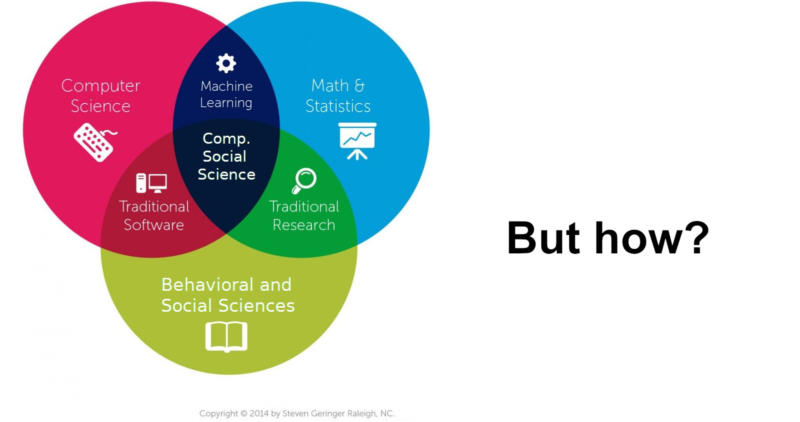
```

---

# *Interdisciplinarity* in CSS

<center>
```{r, echo=FALSE, out.width=950}
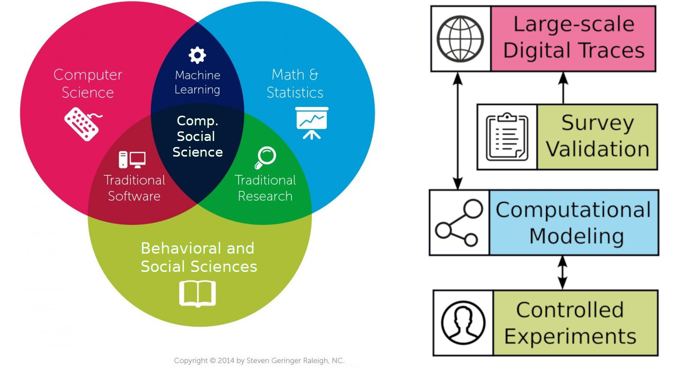
```

---

# Four examples of CSS

<center>
```{r, echo=FALSE, out.width=950}
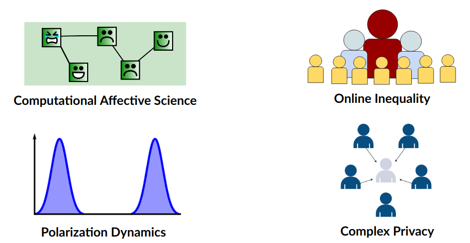
```

---

# Computational Affective Science

<center>
```{r, echo=FALSE, out.width=950}
knitr::include_graphics("figures/CAS.png")
```

---

# Computational Affective Science

**Computational Affective Science:** Combining big social data and computational modeling to understand affective life and emotional well-being
<center>
Vienna Research Group in Complexity Science funded by the 
<br>
Viena Science and Technology Fund  (1.6M Euro)  
```{r, echo=FALSE, out.width=700}
knitr::include_graphics("figures/VRG.png")
```

---


## Examples of Computational Affective Science

.pull-left[
```{r, echo=FALSE, out.width=600}
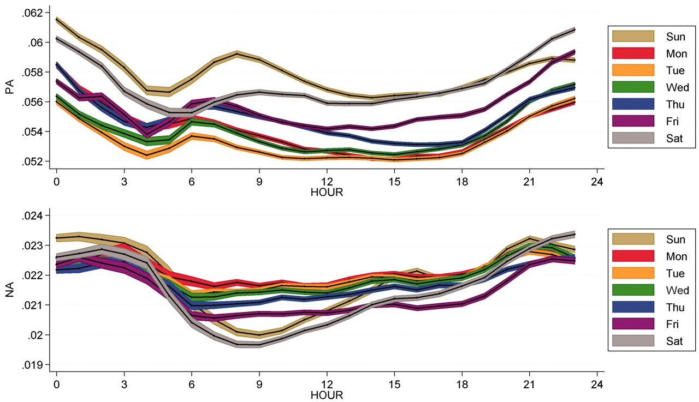
```
Mood expression oscillates in Twitter
]

.pull-right[
```{r, echo=FALSE, out.width=500}
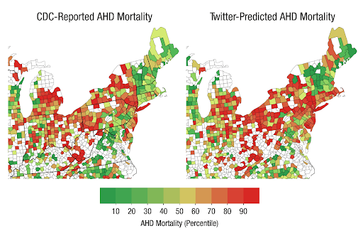
```
Affect in Twitter and heart diseaes
]

<div style="font-size:14pt">
[Diurnal and Seasonal Mood Vary with Work, Sleep, and Daylength Across Diverse Cultures. S. Golder, M. Macy. Science, 2011](https://science.sciencemag.org/content/333/6051/1878)<br>
[Psychological language on Twitter predicts county-level heart disease mortality. J. Eichstaedt et. al. Psychological Science, 2015](https://journals.sagepub.com/doi/10.1177/0956797614557867)
---

layout: true
<div class="my-footer"><span>
<a href=https://doi.org/10.1177%2F0956797619831964> Collective Emotions and Social Resilience in the Digital Traces After a Terrorist Attack. David Garcia Bernard Rimé. Psychological Science (2019)</a></span></div> 

---

## The Social Function of Collective Emotions

<center>
```{r, echo=FALSE, out.width=900}
knitr::include_graphics("figures/ColectiveEmotions.png")
```
</center>

- **Theory of collective effervescence** (Durkheim, 1912):
Shared emotions generate social identity, reinforce shared beliefs, and lead to higher solidarity

- **Collective emotions** (von Scheve and Salmela, 2014):   
Emotional states shared by a large amount of people at the same time


---

background-size: 40%
background-image: url(figures/Trauma.png)
background-position: 90% 60%


## Emotional Responses to Collective Traumas

**How do societies respond to traumatic events?**  
**Is there a social function of collective emotions?**
.pull-left[
- Emotional synchronization: Experience of simultaneous negative emotions

- Collective emotion lasts longer than individual emotional reactions

- Individuals that participate in the collective emotions show higher levels of long-term solidarity ]

---


## Twitter Digital Traces after a Terrorist Attack

Focus on Paris Attacks of of Nov 13, 2015  
Removed bots, news media, and organizations. Final sample of 62,114 users  
Retrieved historical timeline of users. Total of more than 27 Million tweets (no RT)
<center>
```{r, echo=FALSE, out.width=900}
knitr::include_graphics("figures/ParisCase.png")
```

---

## Linguistic Signals

**Linguistic Inquiry and Word Count, LIWC (pronounced “Luke”)**  
- Simple word matching method  
- Generated and validated by psychologists (Pennebaker et al., 2001-2015)
- Multiple classes, calibrated for netspeak and neologisms


.pull-left[
```{r, echo=FALSE, out.width=1000}
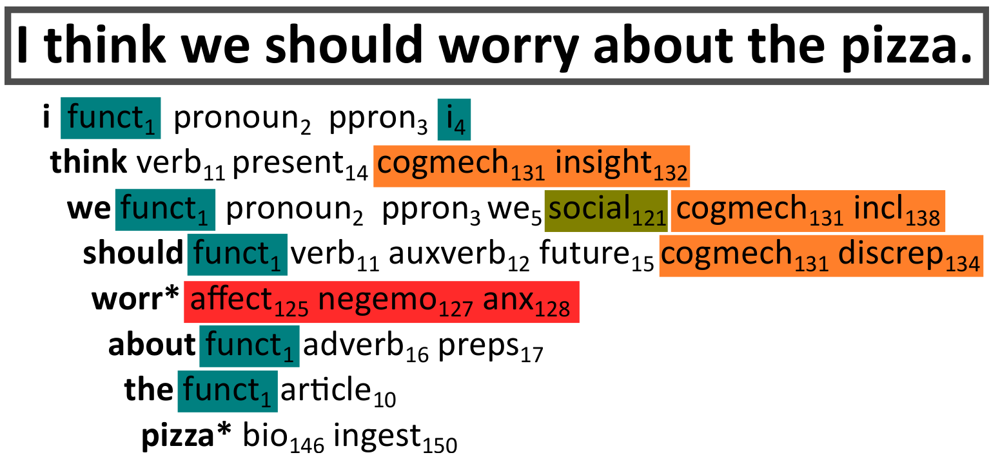
```
]
.pull-right[
**LIWC classes in this study:**  
Positive Affect, Negative Affect  
Anxiety, Sadness, Anger  
Social processes  
Prosocial terms (Frimer, et. al, 2014)  
French values (libert\*, egalit\*, fraternit\*)
]

---

## Agent-Based Modelling of Collective Emotions

.pull-left[
```{r, echo=FALSE, out.width=1000}
knitr::include_graphics("figures/Framework.png")
```

ABM calibrated with experiment data
- φ: post-shock AR(1) term
- φ~0: subcritical response
- φ>0: critical, collective behavior
]

.pull-right[
```{r, echo=FALSE, out.width=450}
knitr::include_graphics("figures/Simulation.png")
```
<center>
Mean valence in simulations
</center>
]

<div style="font-size:14pt">
[The Dynamics of Emotions in Online Interaction. Garcia et al. Royal Society Open Science 3 (2016)](https://royalsocietypublishing.org/doi/full/10.1098/rsos.160059)

---

## Evidence of Collective Emotions
<center>
```{r, echo=FALSE, out.width=750}
knitr::include_graphics("figures/TS.png")
```
</center>

---

### Collective Dynamics of Social Resilience Indicators
<center>
```{r, echo=FALSE, out.width=720}
knitr::include_graphics("figures/TS2.png")
```
</center>


---

## Emotional Synchronization Effect

.pull-left[
<center>
```{r, echo=FALSE, out.width=470}
knitr::include_graphics("figures/TS3.png")
```
</center>
]

.pull-right[
Division of users into two groups based on their emotional expression two weeks after the attacks

Frequency of social process terms:
- Very similar before the attacks
- Strong difference after the attacks
- Difference lasts for months

Similar effect for prosocial terms and shared values terms
]

---

## Conclusions

- Terrorist attacks trigger collective emotions that we can observe online

- Terms related to social resilience increase after collective emotions

- Individuals expressing stronger emotions used on average more terms related to social processes, prosocial behavior, and shared values

- Collective emotions are not just venting, they can keep us together

- Negative effects: inter-group conflict, intolerance, short-term orientation...

- Online interactive visualization at: http://dgarcia.eu/ParisAttacks.html

[**Collective Emotions and Social Resilience in the Digital Traces After a Terrorist Attack.** David Garcia Bernard Rimé. Psychological Science (2019)](https://journals.sagepub.com/doi/full/10.1177/0956797619831964)

---

layout: true
<div class="my-footer"><span>
<a href=https://www.frontiersin.org/articles/10.3389/fdata.2020.00032/full> Dashboard of Sentiment in Austrian Social Media During COVID-19. Max Pellert, Jana Lasser, Hannah Metzler, David Garcia. Frontiers in Big Data (2020)</a></span></div> 

---

## A recent example: The 2020 Vienna terrorist attack

.pull-left[

]
.pull-right[
- Analysis of Twitter response to Vienna terrorist attack of November 2nd, 2020
- 4 civilians killed and 23 people injured by islamist shooters
- Twitter data from Vienna and Austria retrieved with Crimson Hexagon
- LIWC in German as in our Austria Twitter dashboard
]

[Dashboard of Sentiment in Austrian Social Media During COVID-19.  
Frontiers in Big Data. Pellert et al. (2020)](https://www.frontiersin.org/articles/10.3389/fdata.2020.00032/full)  

---

class:center

## Hourly twitter activity in Vienna


---

## Austrian Emotions on Twitter

```{r, echo=FALSE, out.width=850, fig.align='center'}
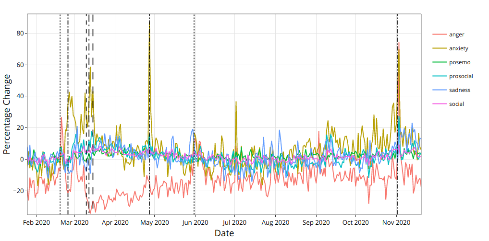
```

Dashboard: https://mpellert.at/covid19_monitor_austria
---

## Austrian Emotions in Der Standard Tickers

```{r, echo=FALSE, out.width=870, fig.align='center'}
knitr::include_graphics("figures/Dashboard2.png")
```

Dashboard: https://mpellert.at/covid19_monitor_austria

---

background-size: 50%
background-image: url(figures/OpenDoor.gif)
background-position: 90% 60%


## Shelter offerings on Twitter

.pull-left[

- Number of tweets with hashtags similar to [#Schwedenplatztür](https://twitter.com/hashtag/schwedenplatzt%C3%BCr)
- More in Twittet thread:
https://twitter.com/dgarcia_eu/status/1324097342551842817
]

---

layout: true
<div class="my-footer"><span>
<a href=http://jasss.soc.surrey.ac.uk/23/3/5.html> A Weighted Balance Model of Opinion Hyperpolarization. Simon Schweighofer, Frank Schweitzer & David Garcia, JASSS (2020)</a></span></div>

---

# Polarization Dynamics

<center>
```{r, echo=FALSE, out.width=950}
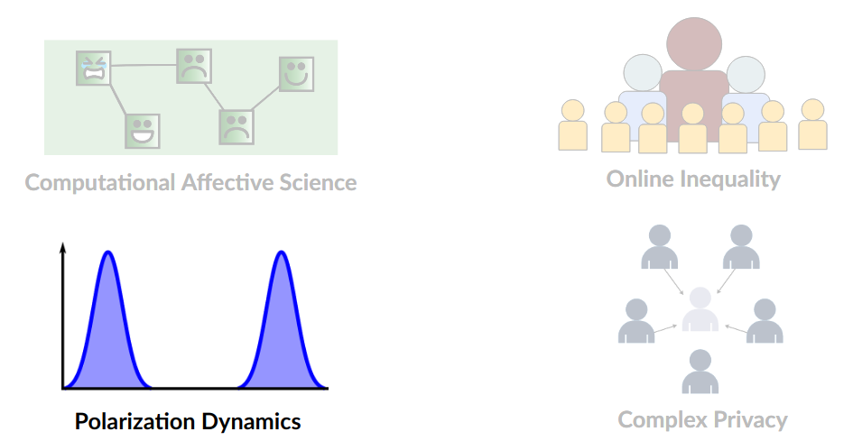
```

---

## Approaches to Polarization

**Opinion polarization:** Two opinion groups with extreme distance in between
[Political Polarization in the American Public. Fiorina & Abrams. Annual Review of Political Science (2008)](https://www.annualreviews.org/doi/10.1146/annurev.polisci.11.053106.153836)

**Relational polarization:** Social structure divided into two groups with high internal connectivity and low inter-group connectivity  
[A sign of the times? Weak and strong polarization in the U.S. Congress, 1973–2016. Neal. Social Networks (2020)](https://www.sciencedirect.com/science/article/abs/pii/S0378873317303039)

**Affective polarization:** Extreme support within groups and hate across groups
[The Origins and Consequences of Affective Polarization in the United States. Iyengar et al. Annual Review of Political Science (2019)](https://www.annualreviews.org/doi/abs/10.1146/annurev-polisci-051117-073034)


**Political sectarianism:** Integration into an interdisciplinary theory  
[Political sectarianism in America. Finkel et al. Science (2020)](https://science.sciencemag.org/content/370/6516/533)

---

# Hyperpolarization

```{r, echo=FALSE, out.width=950, fig.align='center'}
knitr::include_graphics("figures/Hyperpolarization.png")
```
<center>
*Hyperpolarization: Opinion extremeness x Opinion constraint*

---

## Weighted Balance Theory and hyperpolarization

.pull-left[
- Cognitive balance +   
 evaluative extremeness

- ABM show emergence of hyperpolarization

- **Predicts that issues become aligned and polarized over time**
]

.pull-right[
```{r, echo=FALSE, out.width=450}
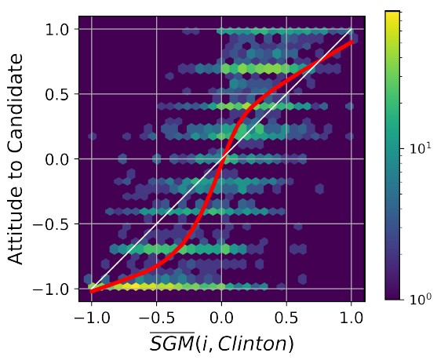
```
]

[A Weighted Balance Model of Opinion Hyperpolarization. Schweighofer, Schweitzer & Garcia, JASSS (2020)](http://jasss.soc.surrey.ac.uk/23/3/5.html)

---
class:center

## Hyperpolarization in Weighted Balance Theory


<iframe width="800" height="500" src="https://www.youtube.com/embed/y4rvLMgqwXQ" frameborder="0" allow="accelerometer; autoplay; encrypted-media; gyroscope; picture-in-picture" allowfullscreen></iframe>

---

layout: true
<div class="my-footer"><span>
<a href=https://doi.org/10.1016/S0140-6736(19)32526-7> EATLancet vs yes2meat: the digital backlash to the planetary health diet. David Garcia, Victor Galaz, Stefan Daume. The Lancet (2019)</a></span></div>

---

## Emergence of polarization in food habits

.pull-left[
- US Food demand Survey

- Self-reported meat consumption intention over time

- Color: party alignment

- Initial increasing trend for both parties

- Start of alignment with party from 2016: eating meat becomes a political issue

]
.pull-right[

```{r, echo=FALSE, out.width=450}
knitr::include_graphics("figures/Trends.png")
```
]

---

## A case of food polarization: the EAT-Lancet report

```{r, echo=FALSE, out.width=1000}
knitr::include_graphics("figures/eatlancet.png")
```

*The first full scientific review of what constitutes a healthy diet from a sustainable food system, and which actions can support and speed up food system transformation. (eatforum.org)*

---

## \#yes2meat: the digital backlash to EAT-Lancet

```{r, echo=FALSE, out.width=1100}
knitr::include_graphics("figures/yes2meat.png")
```
---

## Twitter data on EAT-Lancet and yes2meat

- List of original tweets that contain “EAT-Lancet” (or similar) or “yes2meat” from Twitter search interface (Dec 2018 - April 2019):
  - 7281 EAT-Lancet tweets, 8586 yessmeat tweets, 347 tweets mention both
- Tweet metadata from Twitter API: retweets, links, user profile (4278 users)
  - User profiles and self-description from Twitter API
  - Retrieved list of accounts they follow: 4.9 Million follower links
  - Retrieved timeline up to last (approx)  3200 tweets. 8 Million tweets in total
  - Analyzed automated behavior with botometer (4,203 users)
  - 2,376 unique links shared from tweets

- Manual sentiment annotations (Pro EAT-Lancet, Against EAT-Lancet, neutral, irrelevant) for varous samples (top URLS and samples from each community)
---

class:center

## Time series and URL shares

```{r, echo=FALSE, out.width=950}
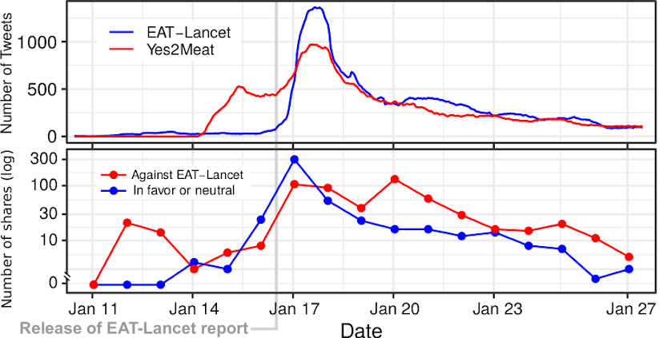
```

---

## Social network analysis
.pull-left[
```{r, echo=FALSE, out.width=500}
knitr::include_graphics("figures/Net.png")
```
]
.pull-right[

]
---

## Social network analysis
.pull-left[
```{r, echo=FALSE, out.width=500}
knitr::include_graphics("figures/Net.png")
```
]
.pull-right[
```{r, echo=FALSE, out.width=950}
knitr::include_graphics("figures/WCblue.png")
```
]
---

## Social network analysis
.pull-left[
```{r, echo=FALSE, out.width=500}
knitr::include_graphics("figures/Net.png")
```
]
.pull-right[
```{r, echo=FALSE, out.width=950}
knitr::include_graphics("figures/WCred.png")
```
]
---

## Social network analysis
.pull-left[
```{r, echo=FALSE, out.width=500}
knitr::include_graphics("figures/Net.png")
```
]
.pull-right[
```{r, echo=FALSE, out.width=490}
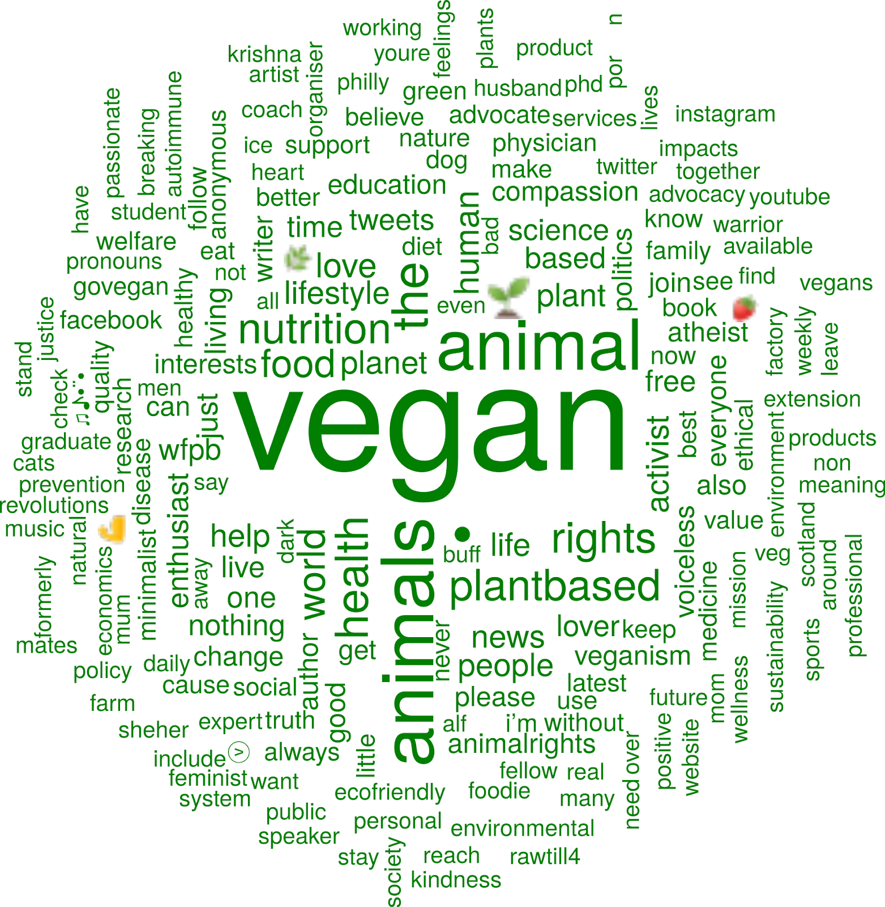
```
]
---

## Social network analysis
.pull-left[
```{r, echo=FALSE, out.width=500}
knitr::include_graphics("figures/Net.png")
```
]
.pull-right[
```{r, echo=FALSE, out.width=950}
knitr::include_graphics("figures/WCyellow.png")
```
]
---

## Retweet changes in yellow community
.pull-left[
```{r, echo=FALSE, out.width=500}
knitr::include_graphics("figures/Net.png")
```
]
.pull-right[
```{r, echo=FALSE, out.width=450}
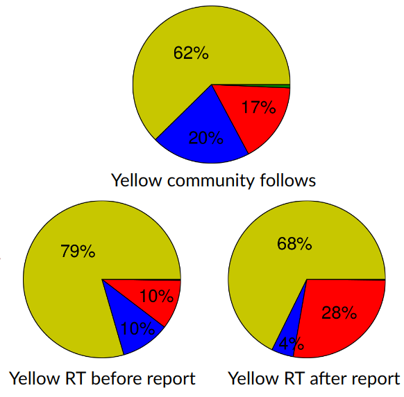
```
]
---

## EAT-Lancet and yes2meat: Summary

- We mapped the digital backlash to EAT-Lancet on Twitter through #yes2meat
- Birth of #yes2meat preceded the release of the report
- Four communities: pro-EAT-Lancet, skeptic, pro-yes2meat, and vegan
- Information flow from pro-yes2meat to skeptic community after report
- Diet polarization: liberal vegan vs conservative keto

Example of emerging polarization towards hyperpolarization as in Weighted Balance Theory

**EATLancet vs yes2meat: the digital backlash to the planetary health diet.**  
David Garcia, Victor Galaz, Stefan Daume. The Lancet 394(10215) (2019)
https://doi.org/10.1016/S0140-6736(19)32526-7

---

layout: true
<div class="my-footer"><span>David Garcia - Computational Social Science Lab - TU Graz + CSH Vienna</span></div> 

---

# Online Inequality

<center>
```{r, echo=FALSE, out.width=950}
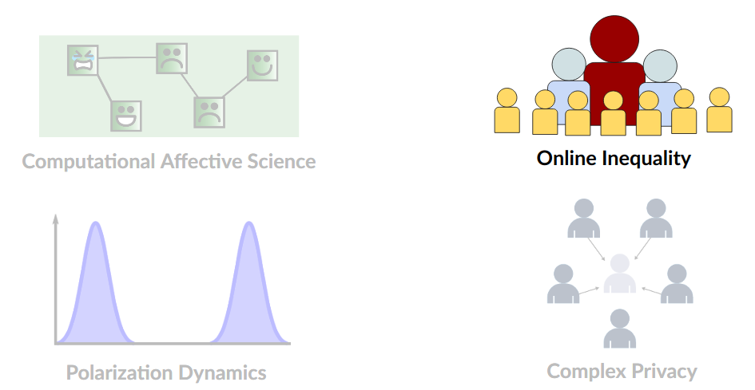
```

---
class:center

# How can social media affect our society?

.pull-left[
Opportunities and benefits

```{r, echo=FALSE, out.width=950}
knitr::include_graphics("figures/FBmap.png")
```
]
--
.pull-right[
Risks and problems

```{r, echo=FALSE, out.width=950}
knitr::include_graphics("figures/zuck.png")
```
]
---

# Technology and Democracy

.pull-left[
```{r, echo=FALSE, out.width=420}
knitr::include_graphics("figures/JRC.png")
```
]

.pull-right[
[**Technology and Democracy: Understanding the influence of online technologies on political behaviour and decision-making.** Stephan Lewandowsky, Laura Smillie, David Garcia, Ralph Hertwig, Jim Weatherall, Stefanie Egidy, Ronald E. Robertson, Cailin O’connor, Anastasia Kozyreva, Philipp Lorenz-Spreen, Yannik Blaschke, and Mark Leiser. Publications Office of the European Union, Luxembourg (2020)](https://op.europa.eu/en/publication-detail/-/publication/49b629ee-1805-11eb-b57e-01aa75ed71a1/language-en)
]

---

layout: true
<div class="my-footer"><span>
<a href=http://www.pnas.org/content/early/2018/06/12/1717781115> Analyzing gender inequality through large-scale Facebook advertising data. David Garcia et al. Proceedings of the National Academy of Sciences (2018)</a></span></div>

---


# Inequality and gender in social media

- The Internet as the Great Potential Equalizer (Hargittai & Hsieh 2013): 
  - Providing opportunities and  information access to everyone?

- "Unequal distribution of Internet access might exacerbate socioeconomic inequalities."
<div style="text-align: right"> <em property="italic"> World Bank: World Development Report 2016: Digital Dividends </em></div>

- "One in five female Internet users live in countries where harassment and abuse of women online is extremely unlikely to be punished." 
<div style="text-align: right"> <em property="italic"> The Web and Rising Global Inequality.  World Wide Web Foundation, 2015 </em></div>

---

## The Facebook Ads API in demographics

```{r, echo=FALSE, out.width=800, fig.align='center'}

```
- Programmatic Interface to automate marketing campaign in Facebook
- Audiences can be tuned by demographic attributes (gender, age, income...) or interests (sports, political parties, entertainment...) 
- Accessible for everyone with a Facebook account - audience metrics for everyone
- Used in demographics and development research (e.g. [Zagheni, Weber, & Gummadi, 2017;](https://doi.org/10.1111/padr.12102) [Mejova et al., 2018;](https://dl.acm.org/doi/abs/10.1145/3209811.3212698) [Fatehkia, Kashyap, & Weber, 2018](https://www.sciencedirect.com/science/article/pii/S0305750X18300883))
- Python package to use it: https://github.com/maraujo/pySocialWatcher

---

## The Facebook Gender Divide 

$R_{g,c}$: Ratio of Facebook active users of gender *g* over all inhabitants of gender *g* in country *c*

<center>

Facebook Gender Divide for country c:  
<br>
$FGD_c= log\left(\frac{R_{Male,c}}{R_{Female_c}}\right)$
</center>

Validation with survey data:
- FGD (217 countries)
- Global Web Index (34 countries)
- Pew Internet research (19 countries)

---

## Validating the FGD with surveys

.pull-left[
```{r, echo=FALSE, out.width=430, fig.align='center'}
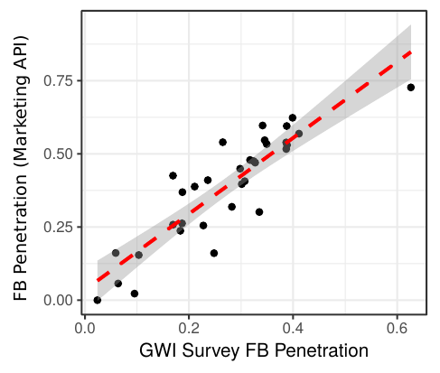
```
]
.pull-right[
```{r, echo=FALSE, out.width=450, fig.align='center'}
knitr::include_graphics("figures/FGDval2.png")
```
]

- High correlations of ranked FGD with each survey (0.63, 0.74)
- Correlation between surveys is lower (0.49) but not significantly lower

---

## The Facebook Gender Divide across countries

```{r, echo=FALSE, out.width=1100, fig.align='center'}
knitr::include_graphics("figures/FGDmap.jpg")
```

---

## The FGD and offline gender inequality

```{r, echo=FALSE, out.width=1100, fig.align='center'}
knitr::include_graphics("figures/FGDreg.jpg")
```
- Regression of FGD rank on WEF gender indices and controls
- Most explanatory variable: Education Gender Equality
---

## The FGD and changes in gender inequality

.pull-left[
```{r, echo=FALSE, out.width=550, fig.align='center'}
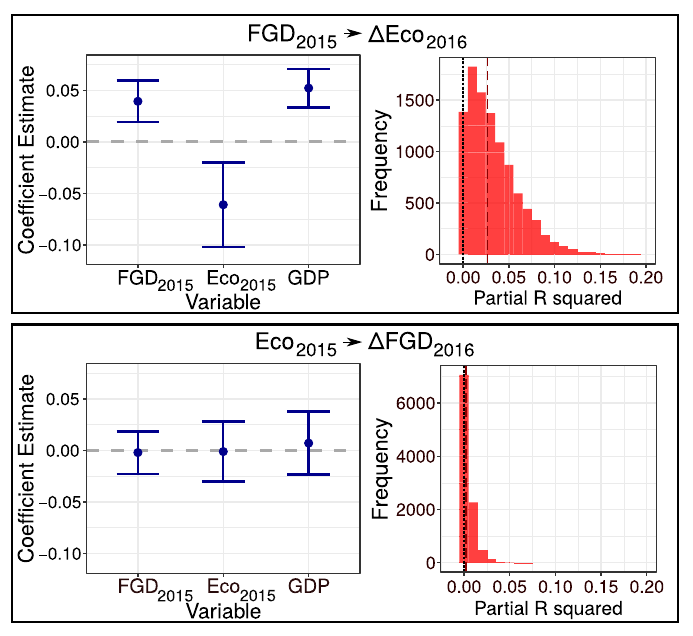
```
]
.pull-right[
- Changes in FGD and WEF gender equality indicators (2015-2016)
- FGD in 2015 improves prediction of changes in economic gender equality
- The reverse case is not present
- Not observable for other equality indices

On average, countries with high FGD rank 
in 2015 (low FGD) tended to approach economic gender equality in 2016
]
---

## Positive externalities in Facebook use

.pull-left[
```{r, echo=FALSE, out.width=450, fig.align='center'}
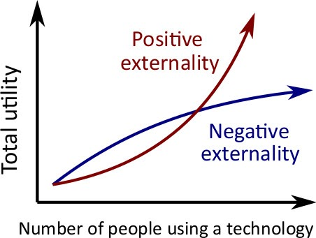
```
]
.pull-right[
```{r, echo=FALSE, out.width=550, fig.align='center'}
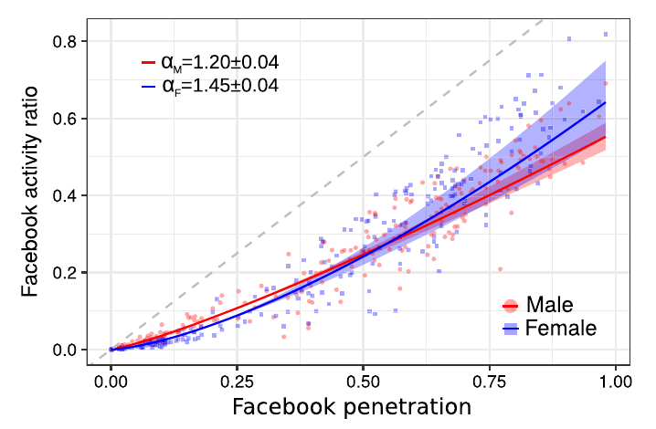
```
]
- Superlinear scaling of activity ratio versus total penetration
- Positive externality: value of using Facebook grows with other people using it

---

## The Facebook Gender Divide: Summary

- Measure of gender divide with FB data comparable to surveys
- This measure captures offline gender equality indices across countries
- Temporal correlation between FGD and changes in economic gender eq.
- Superlinear scaling of FB activity with penetration: positive externality

Social media might also work as a *digital provide*. Is Facebook helping women to find employment in countries with high gender inequality?

For more details:  
[**Analyzing gender inequality through large-scale Facebook advertising data.** David Garcia, Yonas Mitike Kassa, Angel Cuevas, Manuel Cebrian, Esteban Moro, Iyad Rahwan, and Ruben Cuevas
Proceedings of the National Academy of Sciences (2018)](http://www.pnas.org/content/early/2018/06/12/1717781115)
---


layout: true
<div class="my-footer"><span>David Garcia - Computational Social Science Lab - TU Graz + CSH Vienna</span></div> 

---

# Complex Privacy

<center>
```{r, echo=FALSE, out.width=950}
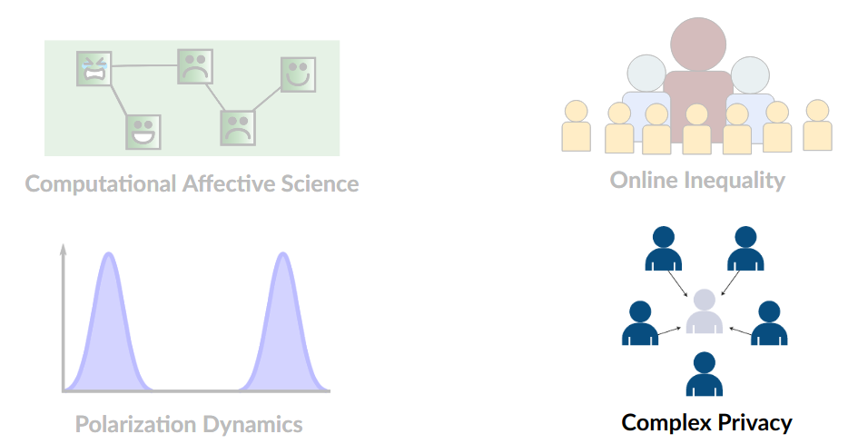
```

---

layout: true
<div class="my-footer"><span>
<a href=https://advances.sciencemag.org/content/3/8/e1701172.full> Leaking privacy and shadow profiles in online social networks. David Garcia. Science Advances (2017) </a></span></div>

---


# Privacy Risks in Online Platforms

- A risk for informational self-determination:
Private traits and attributes are predictable from digital records of human behavior [(Kosinski et al, 2013)](https://www.pnas.org/content/110/15/5802)

- Facebook Likes predict personality, sexual orientation, etc

Individualized solutions to privacy risks
> ”Providing users with transparency and control over their information, leading to an individually controlled balance between the promises and perils of the Digital Age.” *(Kosinski et al, 2013)*

<center>
**Can we guarantee individual control over online privacy?**

---
background-size: 20%
background-image: url(figures/puzzle.jpg)
background-position: 98% 70%

## The Problem of Shadow Profiles

**Facebook Shadow Profile:**  
A file that Facebook keeps on you containing data it pulls from looking at the information that your friends voluntarily provide. [*(Digital Trends, 2013)*](https://www.digitaltrends.com/social-media/what-exactly-is-a-facebook-shadow-profile/)

- 2011: Europe-vs-Facebook files complaint on shadow profiles

- 2013: Bug reveals private information of 6 million users

- Some users notice their shadow profiles with mobile numbers

- Apr 2014: 1B users of Facebook for mobile share  contact lists

- Aug 2016: Whatsapp and Facebook share information

Not a problem unique to Facebook: also in Twitter, Google, Amazon...

---

## Auditing Shadow Profiles

**Shadow profile hypothesis:**
The data shared by the users of an online platform predicts of personal information of non-users

```{r, echo=FALSE, out.width=600, fig.align='center'}
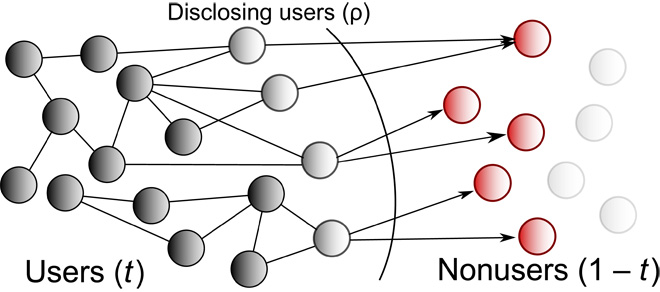
```
**Approach:** historical audit to evaluate how social networking sites could have predicted information of individuals who were not users yet 
<div style="font-size:15pt"> 
[One Plus One Makes Three (for Social Networks). Emöke-Ágnes Horvát, Michael Hanselmann, Fred Hamprecht, Katharina Zweig. Plos ONE (2012)](https://journals.plos.org/plosone/article?id=10.1371/journal.pone.0034740)

---

## Study 1: Friendster
.pull-left[
```{r, echo=FALSE, out.width=550, fig.align='center'}

```
- Internet Archive dataset
- Full track of publicly available data
- Focus on first 20 million users
- 3M profiles with public information
- Profiles contain gender, marital status, and relationship interests
]
.pull-right[
```{r, echo=FALSE, out.width=450, fig.align='center'}
knitr::include_graphics("figures/FriendsterNet.png")
```
]

---

## Assortativity of sensitive features in Friendster

```{r, echo=FALSE, out.width=870, fig.align='center'}
knitr::include_graphics("figures/Radars.png")
```
---

## Unsupervised prediction based on friends

<br>

```{r, echo=FALSE, out.width=1100, fig.align='center'}
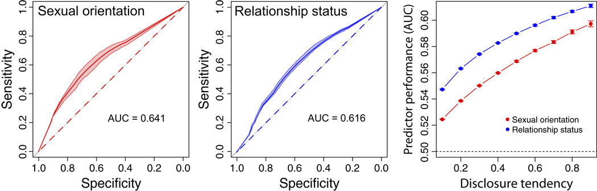
```

---
### Predictive power grows with network size and disclosure

```{r, echo=FALSE, out.width=1100, fig.align='center'}
knitr::include_graphics("figures/preds.png")
```

<center>
Performance of predictor of personal information of non-users grows with: 
network size (t), disclosure tendencies of users (ρ), and their product (t∗ρ)

---

layout: true
<div class="my-footer"><span>
<a href=https://epjdatascience.springeropen.com/articles/10.1140/epjds/s13688-018-0130-3> Collective aspects of privacy in the Twitter social network. David Garcia, Mansi Goel, Amod Agrawal, Ponnurangam Kumaraguru. EPJ Data Science (2018)</a></span></div>

---

## Study 2: Location in Twitter

.pull-left[
```{r, echo=FALSE, out.width=1100, fig.align='center'}
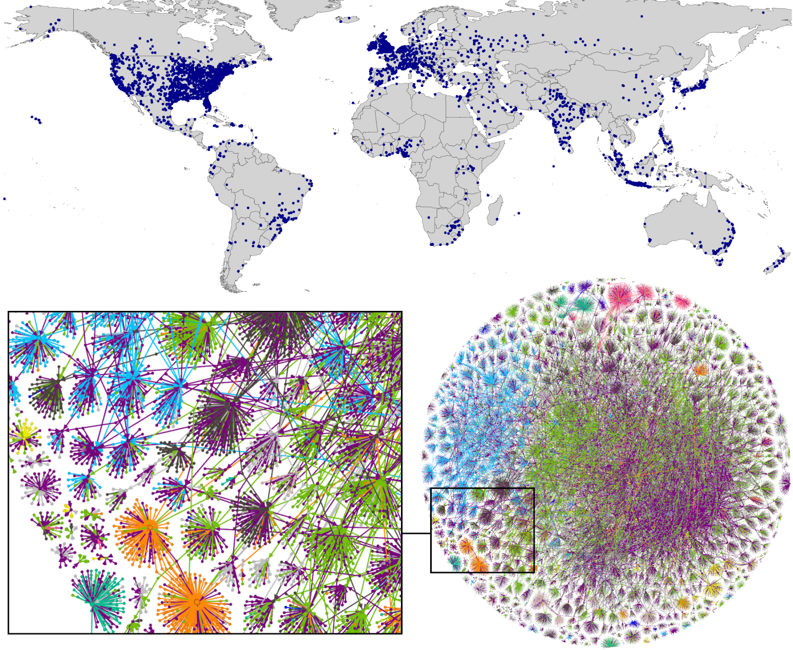
```
]
.pull-right[
- Random sample of 1,017 users
  - excl. bots, mass media
- Ego network of reply links
  - 68,447 alters
- Timelines: 157M tweets
- Location from profile text + Google Maps API
- Tweet metadata to identify users sharing contact lists
]

---

## Twitter shadow profile test

```{r, echo=FALSE, out.width=1100, fig.align='center'}
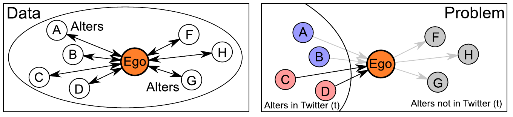
```

- Data represents a bidirectional social network
- Joined date of users shows network growth
- Tweet metadata contains posting app: disclosing users are only those who post at least once from Twitter mobile apps (shared contact lists)
- Predicting location of users who didn't join yet based on disclosing friends already on Twitter
---

## Location prediction and heterogeneity

```{r, echo=FALSE, out.width=1000, fig.align='center'}
knitr::include_graphics("figures/alters.png")
```

- Location prediction of non-users greatly outperforms null model
- Individuals with more alters sharing contact lists in Twitter have lower error

---

## Shadow profiles after leaving a social network

```{r, echo=FALSE, out.width=800, fig.align='center'}
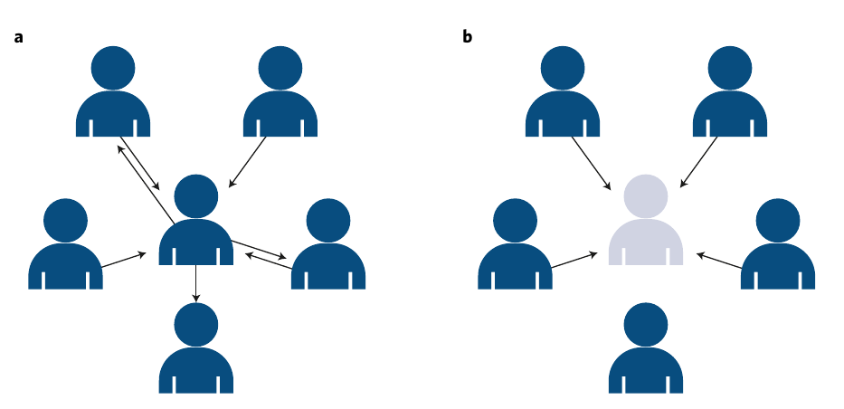
```
<div style="font-size:15pt"> 
[**Privacy beyond the individual.** David Garcia. Nature Human Behavior (2019)](https://www.nature.com/articles/s41562-018-0513-2)

[**Information flow reveals prediction limits in online social activity.** James Bagrow, Xipei Liu & Lewis Mitchell. Nature Human Behavior (2019)](https://doi.org/10.1038/s41562-018-0510-5)

---

### Complex privacy: Online privacy as a collective phenomenon

.pull-left[
- The decision of individuals to share data is mediated by the decisions of others
- Privacy externalities of the contract between a user and a platform
- Complex problems, collective solutions: International data cooperatives
]
.pull-right[
```{r, echo=FALSE, out.width=500, fig.align='center'}
knitr::include_graphics("figures/wired.png")
```
]
<div style="font-size:16pt"> 
[**Online privacy as a collective phenomenon.** E. Sarigol, D. Garcia, F. Schweitzer. Second ACM Conference on Online Social Networks (COSN) (2014)](https://dl.acm.org/doi/10.1145/2660460.2660470)  
[**Leaking privacy and shadow profiles in online social networks.** D. Garcia, Science Advances, 3 (8) e1701172 (2017)](https://advances.sciencemag.org/content/3/8/e1701172.full)  
[**Collective Aspects of Privacy in the Twitter Social Network.** D. Garcia, M. Goel, A. Agrawal, P. Kumaraguru, EPJ Data Science, 7(3) (2018)](https://epjdatascience.springeropen.com/articles/10.1140/epjds/s13688-018-0130-3)  
[**Privacy beyond the individual.** D. Garcia. Nature Human Behavior (2019)](https://www.nature.com/articles/s41562-018-0513-2)
---

layout: true
<div class="my-footer"><span>David Garcia - Computational Social Science Lab - TU Graz + CSH Vienna</span></div> 

---

class:center

## By the Computational Social Science Lab
In collaboration with:
```{r, echo=FALSE, out.width=1200}
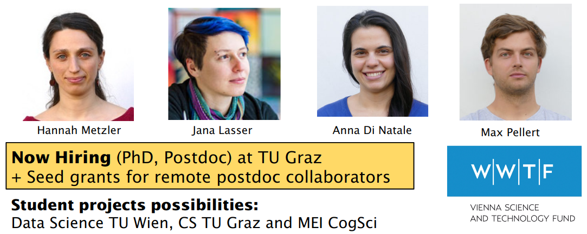
```
**Thanks for listening! More at www.dgarcia.eu and [@dgarcia_eu](https://twitter.com/dgarcia_eu)**
